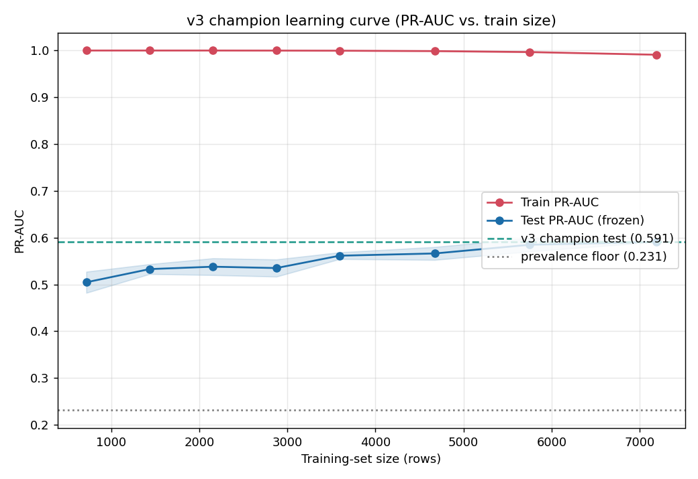

# Learning Curve — v3 Champion Churn Model

**Date:** 2026-06-04
**Script:** `experiments/13_learning_curve.py`
**Plot:** `experiments/_artifacts/learning_curve_v3.png`
**Data dump:** `experiments/_artifacts/learning_curve_v3.json`

## Question

Does training-set size still limit the v3 champion's performance? Has the curve
**plateaued** (more data won't help much, so a data-hungry sequence DNN is
unlikely to pay off) or is it **still rising steeply** (more data is the lever)?

## Method

- **Model:** v3 champion pipeline exactly as `experiments/11_final_v3.py` —
  `make_preprocessor(V3, CAT)` + tuned `XGBClassifier`
  (`experiments/_artifacts/xgb_v3_best_params.json`), `n_jobs=1`.
- **Grid:** training fractions `0.1, 0.2, 0.3, 0.4, 0.5, 0.65, 0.8, 1.0`.
- **Repeats:** R=5 **stratified** subsamples per fraction, seeded per repeat
  (`seed = 1000 + repeat`, via `numpy.random.default_rng`). 8 × 5 = 40 fits.
- **Scoring:** PR-AUC (`floodit.evaluate.metrics.pr_auc`) on (a) the FIXED
  frozen test set (`load_v3("test")`, 799 rows, prevalence 0.231) →
  generalization curve, and (b) the training subsample itself → overfitting gap.
- **References:** v3 champion frozen-test PR-AUC = **0.591**; prevalence floor
  (random-classifier PR-AUC) = **0.231**.

The full-data point reproduces the champion test PR-AUC of **0.591** exactly,
confirming the harness matches `11_final_v3.py`.

## Results

| n_train | frac | test_pr_auc_mean | test_pr_auc_std | train_pr_auc_mean |
|--------:|-----:|-----------------:|----------------:|------------------:|
|     719 | 0.10 |            0.505 |           0.023 |             1.000 |
|    1438 | 0.20 |            0.533 |           0.011 |             1.000 |
|    2157 | 0.30 |            0.538 |           0.018 |             1.000 |
|    2876 | 0.40 |            0.535 |           0.018 |             1.000 |
|    3595 | 0.50 |            0.561 |           0.007 |             1.000 |
|    4673 | 0.65 |            0.566 |           0.014 |             0.999 |
|    5752 | 0.80 |            0.585 |           0.014 |             0.997 |
|    7190 | 1.00 |            0.591 |           0.000 |             0.991 |

(std = 0 at frac=1.0 because there is only one possible full-data subsample.)

## Interpretation

**Verdict: still gently rising, NOT yet plateaued — but the slope is shallow.**

- **Test curve shape.** PR-AUC climbs from 0.505 at 719 rows to 0.591 at 7190
  rows. The gains are front-loaded: most of the rise (0.505 → ~0.56) happens in
  the first half of the data, and the curve flattens toward the high-data end
  without turning fully horizontal.
- **Slope at the high-data end.** Going from 80% → 100% of the data (5752 →
  7190 rows, +1438 rows) buys **+0.0061 test PR-AUC** (0.585 → 0.591). That is
  a tiny gain (~1% relative) for a 25% increase in data, and it is within the
  ±1 std band of the 80% point — i.e. **not statistically resolved**. The
  marginal value of data here is very low and shrinking.
- **Overfitting gap.** Train PR-AUC is pinned near 1.0 at every size (1.000 at
  small sizes, easing to 0.991 at full data). The **train-vs-test gap at full
  data is +0.400** (0.991 train vs 0.591 test). This is a large gap: the model
  memorizes the training subsample almost perfectly while generalizing to ~0.59.
  The gap narrows only marginally as data grows (train drifts down from 1.000 to
  0.991), which is the classic signature of a high-variance learner whose
  variance is being slowly damped by more rows — but the test ceiling it is
  approaching (~0.59) is set by **irreducible noise / limited signal**, not by
  sample size.

**What this means.** The curve is in the flat-ish tail: extrapolating the
80%→100% slope, doubling the data again (to ~14k rows) would plausibly add only
~0.01–0.02 PR-AUC, not a step change. The bottleneck is signal in the existing
24h-window features, not the number of users.

## Implication for the DNN question

**A data-hungry sequence DNN is unlikely to help.** The learning curve has
effectively plateaued at ~7k rows: the last 25% of data added only +0.006
PR-AUC, and the test ceiling sits ~0.40 below a near-perfect training fit,
indicating the limit is signal/noise rather than sample count. Deep sequence
models need *more* data to beat a tuned GBM, and here more data barely moves the
generalization metric. The lever is **richer signal** (better features /
finer-grained behavioral sequences that expose new information), not raw volume
or model capacity. If a DNN is tried, it must justify itself on *information it
extracts that the tabular features miss*, not on scaling with data we don't have
and that the curve says wouldn't help anyway.

## Files

- `experiments/13_learning_curve.py` — learning-curve harness.
- `experiments/_artifacts/learning_curve_v3.png` — train vs. test PR-AUC plot.
- `experiments/_artifacts/learning_curve_v3.json` — per-fraction aggregates.
- `docs/datapowers/reports/2026-06-04-learning-curve.md` — this report.
